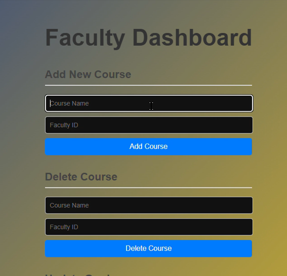

# 🎓 Internal Assessment Portal – KLE Technological University

A responsive and dynamic web application for managing internal assessments at KLE Technological University. Built using **React**, **SQL**, **Bootstrap**, **HTML**, and **CSS**, this system facilitates smooth communication between faculty and students regarding course registration, grade updates, and performance tracking.

---

## 📸 Preview

### 🏠 Home Page  

### 🔐 Login Page  

### 👩‍🏫 Faculty Dashboard  

### 👨‍🎓 Student Portal  

---

## 🚀 Features

### 🏠 Home Page
- Clean landing interface with university branding
- Navigation to **Student Portal** and **Faculty Portal**

### 👩‍🏫 Faculty Module
- **Add Course**: Faculty can add new courses with unique identifiers
- **Delete Course**: Option to remove outdated or incorrect course entries
- **Update Grades**: Faculty can assign or modify grades for each student

### 👨‍🎓 Student Module
- **Enrolled Courses**: Displays all the courses a student is registered in
- **View Grades**: Shows latest grades assigned for each course
- **Performance Overview**: Automatically analyzes and displays student performance per subject (e.g., Excellent, Good, Average)

### 🔒 Authentication
- Separate login pages for students and faculty
- Form validations for email and password

---

## 🛠️ Tech Stack

| Layer         | Technology                           |
|---------------|--------------------------------------|
| Frontend      | React.js, HTML5, CSS3, Bootstrap     |
| Backend/DB    | SQL (MySQL)                          |
| Dev Tools     | Vite, Node.js, npm                   |

